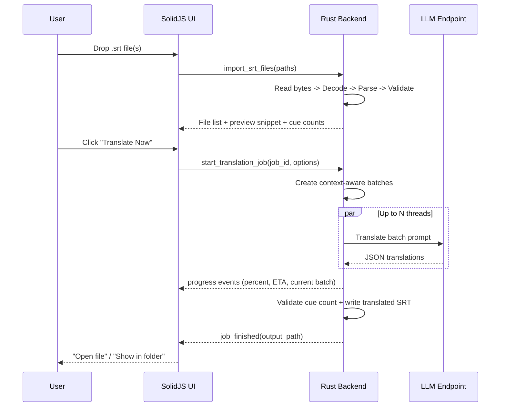
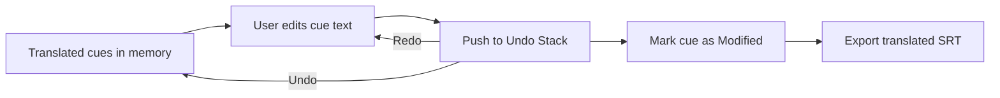

# SRT Subtitle Translator - Complete Implementation Specification

## 1. Executive Summary

**SRT Subtitle Translator** is a fork of ProxyPal’s Tauri + SolidJS desktop architecture, repurposed into a **single-purpose, non-technical-friendly** subtitle translation tool.

It focuses on:

* **One-click translation** with smart defaults (works immediately after API key setup)
* **Context-aware translation** via configurable cue batching + context windows
* **Fast batch execution** using Tokio-based concurrency (1–5 parallel threads)
* **Robust QA** (cue count validation, timecode preservation, side-by-side preview, manual edit, undo/redo)
* **Local-first storage** (no telemetry; config + cache + history stored locally; cache usable offline)

ProxyPal’s strengths we explicitly reuse:

* Cross-platform Tauri app structure (frontend UI + Rust backend with IPC)
* Real-time event streaming from backend to UI
* Production-grade process management patterns and state handling
* “OpenAI-compatible endpoint” support (ProxyPal itself exposes an OpenAI-compatible API)

---

## 2. System Architecture

### 2.1 High-level architecture diagram (Mermaid)

```mermaid
graph TD
  UI[SolidJS + TS UI\n(Upload • Translate • Preview/Edit • Settings)] <-->|invoke commands / listen events| IPC[Tauri IPC + Event Bus]

  subgraph RustBackend[Rust Backend (Tauri v2)]
    Commands[Tauri Commands\n(import, preview, start job, cancel, export, settings)]
    JobQueue[Job Queue + Job State\n(queued/running/done/error)]
    SRT[SRT Module\n(parser • validator • writer)]
    Batch[Batch Manager\n(context windows • token/size control)]
    Worker[Translator Worker\nTokio tasks + Semaphore]
    Client[LLM Clients\nOpenAI-compatible\n+ Direct (Claude/Gemini optional)]
    Store[Local Storage\nConfig + Cache + History]
  end

  IPC --> Commands
  Commands --> JobQueue
  JobQueue --> SRT
  JobQueue --> Batch
  Batch --> Worker
  Worker --> Client
  Worker --> Store
  Worker -->|progress events| IPC

  Client -->|HTTPS| Provider[(LLM Provider Endpoint)]
```

### 2.2 Component breakdown

#### Frontend (SolidJS + TS + Tailwind)

* **Onboarding Wizard** (first-run, step-by-step)
* **Home/Upload**: drag & drop, file queue, status badges
* **Translation**: progress + ETA + live logs, advanced options hidden by default
* **Preview/Edit**: side-by-side cue list, inline edits, undo/redo
* **Settings**: provider + API key, model, concurrency, batch sizing templates

#### Backend (Rust + Tauri v2)

* **Commands layer**: small, stable API surface for UI
* **SRT subsystem**: robust parsing/writing + validation
* **Batch subsystem**: groups cues into contextual batches (20–30 default) with prev/next context
* **Translator subsystem**: multi-threaded parallel batch translation with retry + rate limiting
* **Job manager**: queue, cancel, progress emission, persistent history
* **Storage**: config, translation cache, history logs

#### Translation Engine (core logic)

* Prompt building (provider-agnostic)
* Context windows (before/after cues)
* Output format enforcement (JSON mapping cue IDs → translated text)
* Post-validation (cue count match, tag preservation checks, fallback/retry)

### 2.3 Data flow diagrams

#### 2.3.1 Main translation flow



#### 2.3.2 Preview/Edit + Undo/Redo flow



### 2.4 Recommended file structure for the fork

> Keep ProxyPal’s top-level structure (frontend at root, Rust in `src-tauri/`) as per Tauri’s standard.

```text
srt-subtitle-translator/
├─ src/                         # SolidJS frontend
│  ├─ app.tsx
│  ├─ routes/
│  │  ├─ HomeUpload.tsx
│  │  ├─ Translate.tsx
│  │  ├─ Preview.tsx
│  │  └─ Settings.tsx
│  ├─ components/
│  │  ├─ FileUploader.tsx
│  │  ├─ FileQueueList.tsx
│  │  ├─ ProgressIndicator.tsx
│  │  ├─ SubtitlePreview.tsx
│  │  ├─ LanguageSelector.tsx
│  │  ├─ AdvancedToggle.tsx
│  │  └─ Wizard/
│  │     ├─ WizardShell.tsx
│  │     ├─ StepWelcome.tsx
│  │     ├─ StepProvider.tsx
│  │     ├─ StepApiKey.tsx
│  │     └─ StepTutorial.tsx
│  ├─ stores/
│  │  ├─ fileQueueStore.ts
│  │  ├─ jobStore.ts
│  │  └─ settingsStore.ts
│  ├─ lib/
│  │  ├─ tauri.ts              # invoke + event helpers
│  │  └─ format.ts             # UI formatting, ETA, etc.
│  └─ styles/
│     └─ theme.css
│
├─ src-tauri/
│  ├─ Cargo.toml
│  ├─ tauri.conf.json
│  ├─ capabilities/
│  │  └─ default.json          # allow invoke commands (Tauri v2)
│  └─ src/
│     ├─ lib.rs                # app entry + command registration
│     ├─ state.rs              # AppState + initialization
│     ├─ commands/
│     │  ├─ mod.rs
│     │  ├─ files.rs           # import, preview, export
│     │  ├─ jobs.rs            # start/cancel/status/list
│     │  └─ settings.rs        # get/set config, test connection
│     ├─ srt/
│     │  ├─ mod.rs
│     │  ├─ types.rs
│     │  ├─ parser.rs
│     │  ├─ writer.rs
│     │  └─ validate.rs
│     ├─ translate/
│     │  ├─ mod.rs
│     │  ├─ batcher.rs
│     │  ├─ prompt.rs
│     │  ├─ worker.rs
│     │  ├─ rate_limit.rs
│     │  └─ clients/
│     │     ├─ mod.rs
│     │     ├─ openai_compat.rs
│     │     ├─ anthropic.rs
│     │     └─ gemini.rs
│     ├─ storage/
│     │  ├─ mod.rs
│     │  ├─ config.rs
│     │  ├─ cache.rs
│     │  └─ history.rs
│     └─ util/
│        ├─ json_extract.rs
│        └─ text_mask.rs
└─ README.md
```

---

## 3. Technical Implementation

### 3.1 Backend Components (Rust + Tauri)

#### 3.1.1 File Operations

##### SRT parser module

Responsibilities:

* Read file bytes safely
* Detect encoding (UTF‑8 BOM, UTF‑16, fallback guess)
* Parse into structured cues
* Preserve timing line + newline style
* Return friendly errors with line numbers and suggestions

Key functions:

* `parse_srt_file(path: &Path) -> Result<SrtDocument, SrtError>`
* `parse_srt_bytes(bytes: &[u8]) -> Result<SrtDocument, SrtError>`

Edge cases handled:

* Windows newlines (`\r\n`)
* Missing numeric cue index line (recoverable)
* Time line settings after end time (e.g., `position:50%`)
* Empty cues
* Malformed timecodes with specific line error

##### SRT writer module

Responsibilities:

* Rebuild `.srt` with **identical cue ordering and cue count**
* Preserve timecodes unchanged
* Preserve newline style (`LF` vs `CRLF`)
* Keep markup tags and formatting the user edited

Key functions:

* `write_srt(doc: &SrtDocument, translated: &TranslatedMap) -> String`
* `write_srt_to_path(...)`

##### File validation logic

Checks:

* Cue count unchanged after translation
* Every cue has translation output (or explicitly left unchanged)
* Timecodes unchanged (start/end match original)
* Optional: basic tag balance check (`<i>...</i>` etc.)

#### 3.1.2 Translation Engine

##### Batch creation algorithm (context-aware grouping)

**Goal**: high-quality translation while still fast and API-friendly.

Default behavior:

* Batch targets: **25 cues** (20–30 recommended)
* Context window: **2 cues before + 2 cues after**
* Token safety: cap by estimated character count; auto-shrink batch if needed

Algorithm outline:

1. Walk cues in order, slice into batches of `batch_size`
2. For each batch, attach `context_before` and `context_after`
3. Estimate prompt size; if too large, reduce `batch_size` for that batch
4. Assign **stable cue IDs** (0..N-1) so output mapping is reliable

##### Multi-threaded processing with Tokio

* Use `tokio::sync::Semaphore` to enforce `1..=5` concurrent requests
* Spawn one task per batch
* Each task:

  * checks cancellation token
  * reads cache (skip or partial skip)
  * calls provider API with retry + rate limit
  * parses JSON output robustly
  * updates progress + emits event

##### API client implementation

**Option A: OpenAI-compatible endpoint (recommended default)**
This supports:

* ProxyPal local endpoint
* OpenAI-compatible third-party routers
* Standard OpenAI Chat Completions endpoint (`POST /v1/chat/completions`)

**Option B: Direct provider APIs (Advanced)**

* Claude: `https://api.anthropic.com` with Messages API `POST /v1/messages`
* Gemini: `models.generateContent` endpoint in Gemini API

##### Progress tracking system

Maintain:

* `total_cues`
* `done_cues`
* `total_batches`
* `done_batches`
* `start_time`
* `avg_ms_per_cue` computed from completed work

ETA:

* `eta_seconds = (elapsed_seconds / max(done_cues,1)) * (total_cues - done_cues)`

Emit event payload (example):

```json
{
  "jobId": "…",
  "fileName": "episode1.srt",
  "doneCues": 400,
  "totalCues": 1000,
  "percent": 40.0,
  "etaSeconds": 110,
  "stage": "translating",
  "activeThreads": 3
}
```

#### 3.1.3 State Management

##### App configuration structure

Store:

* Provider selection + base URL
* API key (secure storage recommended)
* Default language pair
* Batch size, context window, thread count
* Retry policy + rate limiting
* UI mode flags (simple/advanced)

Paths:

* Store config in **app config dir** (Tauri path helpers exist in JS and Rust)

##### Translation job queue

* Maintain a queue of `TranslationJob` objects
* Default: process one file at a time (safer for non-tech)
* Advanced: “Parallel files” toggle (optional later)

##### Cache management

* Key: hash(source_lang + target_lang + normalized_text + model)
* Value: translated text + timestamp
* Disk persistence; usable offline for repeated lines

#### 3.1.4 Tauri Commands

Below is a complete set of commands you’ll need.

> Naming convention: keep commands small, explicit, and UI-friendly.

##### Files

1. `import_srt_files(paths: Vec<String>) -> Result<Vec<FileItem>, String>`

   * Parses each SRT, returns metadata + preview excerpt.
2. `get_srt_preview(file_id: String, from: usize, limit: usize) -> Result<PreviewChunk, String>`
3. `remove_file(file_id: String) -> Result<(), String>`
4. `export_translated_srt(job_id: String, output_dir: Option<String>) -> Result<String, String>`

##### Jobs

5. `create_job(file_id: String, options: TranslationOptions) -> Result<JobInfo, String>`
6. `start_job(job_id: String) -> Result<(), String>`
7. `cancel_job(job_id: String) -> Result<(), String>`
8. `get_job(job_id: String) -> Result<JobInfo, String>`
9. `list_jobs() -> Result<Vec<JobInfo>, String>`

##### Editing

10. `update_translated_cue(job_id: String, cue_id: usize, new_text: String) -> Result<(), String>`
11. `bulk_update_translations(job_id: String, updates: Vec<CueUpdate>) -> Result<(), String>`

##### Settings + Provider

12. `get_config() -> Result<AppConfigPublic, String>`
13. `set_config(config: AppConfigInput) -> Result<(), String>`
14. `set_api_key(provider_id: String, api_key: String) -> Result<(), String>`
15. `test_connection(options: ConnectionTest) -> Result<ConnectionTestResult, String>`

##### Cache + History

16. `get_cache_stats() -> Result<CacheStats, String>`
17. `clear_cache() -> Result<(), String>`
18. `list_history() -> Result<Vec<HistoryEntry>, String>`
19. `clear_history() -> Result<(), String>`

##### Input/Output Types (Rust)

All types must be `Serialize + Deserialize` for IPC.

* `FileItem { id, path, name, cue_count, detected_newline, status }`
* `TranslationOptions { provider, source_lang, target_lang, batch_size, threads, context_before, context_after, model, rate_limit, retries }`
* `JobInfo { id, file_id, status, progress, eta_seconds, output_path? }`
* `PreviewChunk { file_id, cues: Vec<PreviewCue> }`

---

### 3.2 Frontend Components (SolidJS + TypeScript)

#### 3.2.1 Pages

1. **Home/Upload**

   * Large drag & drop zone
   * File queue list
   * “Translate Now” primary button

2. **Translation**

   * Live progress bar + ETA
   * Per-file status
   * “Cancel” / “Retry” actions
   * Advanced options hidden by default

3. **Preview**

   * Side-by-side scrollable cue list
   * Inline editing for each cue
   * Undo/Redo
   * Export button

4. **Settings**

   * Provider templates (OpenAI / Claude / Gemini / Custom / ProxyPal endpoint)
   * API key management
   * Defaults: language pair, batch size, threads
   * “Test connection” button

#### 3.2.2 Components

* `FileUploader`
  Drag-and-drop + “Choose file” fallback
* `ProgressIndicator`
  Progress bar + ETA + animated shimmer
* `SubtitlePreview`
  Virtualized list for large files (10k+ cues)
* `LanguageSelector`
  Simple dropdown with “Auto-detect” in source selector
* `BatchSizeSlider`
  Hidden in “Advanced” drawer
* `AdvancedToggle`
  Expands advanced options

#### 3.2.3 State Stores

* `fileQueueStore`

  * files array, statuses, selected file
* `jobStore`

  * active job, progress payloads from events
* `settingsStore`

  * persisted settings loaded at startup

---

### 3.3 Integration Points

#### 3.3.1 Event channels (backend → frontend)

Recommended event names:

* `translation://job-created`
* `translation://progress`
* `translation://warning`
* `translation://error`
* `translation://finished`
* `translation://cancelled`

Frontend listens once and updates stores.

#### 3.3.2 Command usage (frontend → backend)

* File drop triggers `import_srt_files`
* Translate triggers `create_job` then `start_job`
* Preview loads with `get_srt_preview` (paged/virtualized)
* Export triggers `export_translated_srt`

---

## 4. User Experience Design

### 4.1 User Flows

#### 4.1.1 First-time onboarding wizard (non-tech friendly)

**Step 1 — Welcome**

* Title: “Translate subtitles in one click”
* Subtitle: “Drop an .srt file → Translate → Download”
* Button: “Get Started”

**Step 2 — Choose provider**
Big cards:

* “OpenAI (API key)”
* “Claude (API key)”
* “Gemini (API key)”
* “Custom endpoint (Advanced)”
* “ProxyPal local endpoint (if you already use ProxyPal)”

**Step 3 — API key setup**

* Single input box (with show/hide)
* “Test Connection” button
* Help link: “Where do I get this key?”

  * OpenAI endpoint docs: `POST /v1/chat/completions`
  * Claude API overview (Messages API)
  * Gemini generateContent reference

**Step 4 — Quick tutorial**
3 panels:

1. Upload
2. Translate
3. Preview & Download

**Step 5 — Done**

* “Drop your first .srt file now”

#### 4.1.2 Main “Simple Mode” flow (default)

1. Drop .srt
2. Click **Translate Now**
3. Wait until success
4. Download/open output file

Advanced options are behind a single “Advanced” button.

### 4.2 UI Components & Wireframes

#### 4.2.1 Home/Upload (wireframe)

```text
┌───────────────────────────────────────────────────────────┐
│  SRT Subtitle Translator                                   │
│  [⚙ Settings]                                              │
├───────────────────────────────────────────────────────────┤
│                                                           │
│  ╔══════════════════════════════════════════════════════╗  │
│  ║  Drop your .srt file here                             ║  │
│  ║  or [Choose File]                                     ║  │
│  ╚══════════════════════════════════════════════════════╝  │
│                                                           │
│  Files                                                     │
│  ┌──────────────────────────────────────────────────────┐ │
│  │ episode1.srt   ● Ready                               │ │
│  │ episode2.srt   ● Waiting                             │ │
│  └──────────────────────────────────────────────────────┘ │
│                                                           │
│                 [ Translate Now ]                          │
│                                                           │
└───────────────────────────────────────────────────────────┘
```

#### 4.2.2 Translation page (wireframe)

```text
┌───────────────────────────────────────────────────────────┐
│ Translating: episode1.srt                                  │
├───────────────────────────────────────────────────────────┤
│  Progress: [███████████░░░░░░░░░░] 42%   ETA: 01:32        │
│  Batches: 7/17     Threads: 3                              │
│                                                           │
│  [ Cancel ]                                   [ Advanced ] │
│                                                           │
│  Live status                                                │
│  • Translating cues 401–425                                 │
│  • Retrying (rate limit)                                    │
└───────────────────────────────────────────────────────────┘
```

#### 4.2.3 Preview/Edit (wireframe)

```text
┌───────────────────────────────────────────────────────────┐
│ Preview & Edit                     [Undo] [Redo] [Export]  │
├───────────────────────────────────────────────────────────┤
│ 00:01:12,100 --> 00:01:15,000                              │
│  Original:   "I can’t believe it."                          │
│  Translated: "Tôi không thể tin được."  [edit ✎]           │
│                                                           │
│  (scroll…)                                                 │
└───────────────────────────────────────────────────────────┘
```

### 4.3 Error Handling (non-technical)

Principles:

* Always explain “what happened” + “what to do next”
* Avoid codes like “HTTP 429” in the main message; put details under “More details”

Examples:

**API key invalid**

* Title: “Your API key didn’t work”
* Fix: “Copy/paste the key again” + “Check you selected the right provider”
* Button: “Test Again”

**Rate limit**

* Title: “The translation is taking a short break”
* Explanation: “Your provider asked us to slow down”
* Fix: “We’ll retry automatically” + optional “Lower Threads” suggestion

**Malformed SRT**

* Title: “This subtitle file has a formatting problem”
* Fix: “Try exporting subtitles again (UTF‑8). If you can, open it in Subtitle Edit and re-save as .srt”

**Translation mismatch (wrong cue count)**

* Title: “We couldn’t safely apply the translation”
* Fix: “We’ll retry with a safer mode (smaller batches).”
* Option: “Switch to line-by-line mode”

---

## 5. Development Roadmap

### 5.1 Phase 1: Core Features (MVP)

Checklist:

* [ ] Drag-and-drop import + queue
* [ ] SRT parse/write with validation
* [ ] Batch translation (context windows)
* [ ] Concurrency (1–5 threads) + progress events + ETA
* [ ] Settings (provider + API key + language pair)
* [ ] Export translated SRT
* [ ] Preview (read-only)

### 5.2 Phase 2: Polish (non-tech UX)

* [ ] Onboarding wizard
* [ ] Templates (Anime / YouTube / Lecture)
* [ ] Side-by-side preview + manual edits
* [ ] Undo/Redo
* [ ] Clear, friendly error messages
* [ ] Virtualized preview for 10k+ cues

### 5.3 Phase 3: Advanced Features

* [ ] Translation memory + glossary
* [ ] Per-speaker style rules
* [ ] Batch auto-sizing by token estimates
* [ ] Multi-file parallel processing
* [ ] “Resume job” after restart
* [ ] Optional local LLM support (if user provides endpoint)

---

## 6. Code Examples

Below are **complete, production-ready** code templates for the requested critical modules.

> These are written to drop into the proposed file structure and compile once you add the listed dependencies.

---

### 6.1 A. SRT Parser (Rust)

**File:** `src-tauri/src/srt/mod.rs`

```rust
//! SRT parsing + writing with robust error handling.
//!
//! Goals:
//! - Parse common + slightly malformed SRT files
//! - Preserve timecodes and cue ordering
//! - Detect encoding (UTF-8/UTF-16 + best-effort fallback)
//! - Return helpful errors with line numbers and suggestions

use serde::{Deserialize, Serialize};
use std::{borrow::Cow, fs, path::Path};

use thiserror::Error;

#[derive(Debug, Clone, Copy, Serialize, Deserialize)]
pub enum NewlineStyle {
  Lf,
  CrLf,
}

impl NewlineStyle {
  pub fn as_str(self) -> &'static str {
    match self {
      NewlineStyle::Lf => "\n",
      NewlineStyle::CrLf => "\r\n",
    }
  }
}

#[derive(Debug, Clone, Serialize, Deserialize, PartialEq, Eq)]
pub struct SrtTime {
  pub hours: u32,
  pub minutes: u32,
  pub seconds: u32,
  pub millis: u32,
}

impl SrtTime {
  pub fn format(&self) -> String {
    format!(
      "{:02}:{:02}:{:02},{:03}",
      self.hours, self.minutes, self.seconds, self.millis
    )
  }
}

#[derive(Debug, Clone, Serialize, Deserialize)]
pub struct SrtCue {
  /// Stable internal cue id (0..N-1) used for translation mapping.
  pub id: usize,

  /// Raw index line (usually "1", "2", ...). Preserved for writing.
  pub index_line: String,

  /// Raw timing line, preserved exactly as in input (trimmed).
  pub timing_line: String,

  pub start: SrtTime,
  pub end: SrtTime,

  /// Subtitle text lines as-is (without trailing newline).
  pub text_lines: Vec<String>,
}

#[derive(Debug, Clone, Serialize, Deserialize)]
pub struct SrtDocument {
  pub newline: NewlineStyle,
  pub cues: Vec<SrtCue>,
}

#[derive(Debug, Error)]
pub enum SrtError {
  #[error("Failed to read file: {0}")]
  Io(#[from] std::io::Error),

  #[error("This file is not valid text or has an unsupported encoding. {hint}")]
  Encoding { hint: String },

  #[error("Invalid SRT format on line {line}: {message}")]
  Format { line: usize, message: String },
}

/// Read + decode bytes from disk and parse into SrtDocument.
pub fn parse_srt_file(path: &Path) -> Result<SrtDocument, SrtError> {
  let bytes = fs::read(path)?;
  parse_srt_bytes(&bytes)
}

/// Parse an SRT file from raw bytes.
pub fn parse_srt_bytes(bytes: &[u8]) -> Result<SrtDocument, SrtError> {
  let (text, newline) = decode_best_effort(bytes)?;
  parse_srt_str(&text, newline)
}

/// Best-effort decode:
/// - UTF-8 BOM
/// - UTF-16 LE/BE BOM
/// - UTF-8 (strict)
/// - fallback: chardetng guess + encoding_rs decode
fn decode_best_effort(bytes: &[u8]) -> Result<(String, NewlineStyle), SrtError> {
  // Fast BOM checks
  if bytes.starts_with(&[0xEF, 0xBB, 0xBF]) {
    let s = std::str::from_utf8(&bytes[3..]).map_err(|_| SrtError::Encoding {
      hint: "The file looks like UTF-8 with BOM, but it contains invalid UTF-8 bytes. Try re-saving as UTF-8.".into(),
    })?;
    return Ok((normalize_bom(s), detect_newline_style(s)));
  }

  if bytes.starts_with(&[0xFF, 0xFE]) {
    // UTF-16 LE
    let (cow, _, had_errors) = encoding_rs::UTF_16LE.decode(&bytes[2..]);
    if had_errors {
      return Err(SrtError::Encoding {
        hint: "The file looks like UTF-16 (LE) but contains invalid sequences. Try exporting subtitles again as UTF-8.".into(),
      });
    }
    let s = cow.into_owned();
    return Ok((normalize_bom(&s), detect_newline_style(&s)));
  }

  if bytes.starts_with(&[0xFE, 0xFF]) {
    // UTF-16 BE
    let (cow, _, had_errors) = encoding_rs::UTF_16BE.decode(&bytes[2..]);
    if had_errors {
      return Err(SrtError::Encoding {
        hint: "The file looks like UTF-16 (BE) but contains invalid sequences. Try exporting subtitles again as UTF-8.".into(),
      });
    }
    let s = cow.into_owned();
    return Ok((normalize_bom(&s), detect_newline_style(&s)));
  }

  // Try UTF-8 strict
  if let Ok(s) = std::str::from_utf8(bytes) {
    return Ok((normalize_bom(s), detect_newline_style(s)));
  }

  // Fallback: detect with chardetng + decode with encoding_rs
  let mut detector = chardetng::EncodingDetector::new();
  detector.feed(bytes, true);
  let encoding = detector.guess(None, true);
  let (cow, _, had_errors) = encoding.decode(bytes);
  if had_errors {
    return Err(SrtError::Encoding {
      hint: format!(
        "We tried decoding this file as {}, but it still contained invalid characters. Try re-saving the .srt file as UTF-8.",
        encoding.name()
      ),
    });
  }
  let s = cow.into_owned();
  Ok((normalize_bom(&s), detect_newline_style(&s)))
}

fn normalize_bom(s: &str) -> String {
  // Handle U+FEFF if it appears as a Unicode BOM in text.
  s.trim_start_matches('\u{feff}').to_string()
}

fn detect_newline_style(s: &str) -> NewlineStyle {
  if s.contains("\r\n") {
    NewlineStyle::CrLf
  } else {
    NewlineStyle::Lf
  }
}

/// Parse SRT text into document.
/// `newline` is what we detected; output writer will keep it.
pub fn parse_srt_str(text: &str, newline: NewlineStyle) -> Result<SrtDocument, SrtError> {
  // Normalize newlines for parsing.
  let normalized = text.replace("\r\n", "\n").replace('\r', "\n");
  let lines: Vec<&str> = normalized.split('\n').collect();

  let mut cues: Vec<SrtCue> = Vec::new();
  let mut i: usize = 0;
  let mut next_recovered_index: usize = 1;

  while i < lines.len() {
    // Skip blank lines
    while i < lines.len() && lines[i].trim().is_empty() {
      i += 1;
    }
    if i >= lines.len() {
      break;
    }

    // Attempt to parse index line, but allow recovery if missing.
    let index_line = lines[i].trim().to_string();

    let (index_line_used, timing_line_idx) = if is_all_digits(&index_line) {
      (index_line, i + 1)
    } else if looks_like_timing_line(lines[i]) {
      // Missing index line, recover
      let recovered = next_recovered_index.to_string();
      (recovered, i)
    } else {
      return Err(SrtError::Format {
        line: i + 1,
        message: "Expected a cue number (e.g., '1') or a timing line (e.g., '00:00:01,000 --> 00:00:03,000')."
          .into(),
      });
    };

    if timing_line_idx >= lines.len() {
      return Err(SrtError::Format {
        line: timing_line_idx + 1,
        message: "Unexpected end of file while reading timing line.".into(),
      });
    }

    let timing_raw = lines[timing_line_idx].trim();
    if !looks_like_timing_line(timing_raw) {
      return Err(SrtError::Format {
        line: timing_line_idx + 1,
        message: "Expected a timing line like '00:00:01,000 --> 00:00:03,000'.".into(),
      });
    }

    let (start, end) = parse_timing_line(timing_raw).map_err(|msg| SrtError::Format {
      line: timing_line_idx + 1,
      message: msg,
    })?;

    // Read text lines until blank line or EOF
    let mut text_lines: Vec<String> = Vec::new();
    let mut j = timing_line_idx + 1;
    while j < lines.len() && !lines[j].trim().is_empty() {
      text_lines.push(lines[j].to_string());
      j += 1;
    }

    // Build cue
    let cue_id = cues.len();
    cues.push(SrtCue {
      id: cue_id,
      index_line: index_line_used,
      timing_line: timing_raw.to_string(),
      start,
      end,
      text_lines,
    });

    next_recovered_index += 1;
    i = j + 1; // move past blank separator
  }

  if cues.is_empty() {
    return Err(SrtError::Format {
      line: 1,
      message: "No subtitle cues found. Make sure this is a valid .srt file.".into(),
    });
  }

  Ok(SrtDocument { newline, cues })
}

fn is_all_digits(s: &str) -> bool {
  !s.is_empty() && s.chars().all(|c| c.is_ascii_digit())
}

fn looks_like_timing_line(s: &str) -> bool {
  s.contains("-->")
}

fn parse_timing_line(line: &str) -> Result<(SrtTime, SrtTime), String> {
  let arrow = "-->";
  let pos = line.find(arrow).ok_or_else(|| "Timing line is missing the '-->' separator.".to_string())?;

  let left = line[..pos].trim();
  let right = line[pos + arrow.len()..].trim();

  // Right side can include settings after end time. We only parse first token as end time.
  let mut right_parts = right.split_whitespace();
  let end_token = right_parts
    .next()
    .ok_or_else(|| "Timing line is missing end time after '-->'.".to_string())?;

  let start = parse_time(left).map_err(|e| format!("Invalid start time: {e}"))?;
  let end = parse_time(end_token).map_err(|e| format!("Invalid end time: {e}"))?;

  Ok((start, end))
}

fn parse_time(s: &str) -> Result<SrtTime, String> {
  // Accept "HH:MM:SS,mmm" or "HH:MM:SS.mmm"
  let s = s.trim();
  let parts: Vec<&str> = s.split(':').collect();
  if parts.len() != 3 {
    return Err(format!("Expected time like HH:MM:SS,mmm but got '{s}'"));
  }

  let hours: u32 = parts[0].parse().map_err(|_| format!("Invalid hours in '{s}'"))?;
  let minutes: u32 = parts[1].parse().map_err(|_| format!("Invalid minutes in '{s}'"))?;

  let sec_part = parts[2];
  let (sec_str, ms_str) = if let Some((a, b)) = sec_part.split_once(',') {
    (a, b)
  } else if let Some((a, b)) = sec_part.split_once('.') {
    (a, b)
  } else {
    return Err(format!("Expected seconds and milliseconds like SS,mmm in '{s}'"));
  };

  let seconds: u32 = sec_str.parse().map_err(|_| format!("Invalid seconds in '{s}'"))?;
  let millis: u32 = ms_str.parse().map_err(|_| format!("Invalid milliseconds in '{s}'"))?;

  if minutes > 59 || seconds > 59 || millis > 999 {
    return Err(format!("Time components out of range in '{s}'"));
  }

  Ok(SrtTime {
    hours,
    minutes,
    seconds,
    millis,
  })
}

/// Validate translation output: must match cue count.
/// You can add more checks (tag integrity, etc.) as needed.
pub fn validate_translation_count(doc: &SrtDocument, translated: &std::collections::HashMap<usize, String>) -> Result<(), String> {
  if translated.len() != doc.cues.len() {
    return Err(format!(
      "Translation mismatch: expected {} cues but got {} translations.",
      doc.cues.len(),
      translated.len()
    ));
  }
  Ok(())
}

/// Write translated SRT content, preserving timing lines and newline style.
/// `translated` maps cue_id -> translated text (may contain '\n' to represent multi-line cues).
pub fn write_srt(doc: &SrtDocument, translated: &std::collections::HashMap<usize, String>) -> Result<String, String> {
  validate_translation_count(doc, translated)?;

  let nl = doc.newline.as_str();
  let mut out = String::new();

  for cue in &doc.cues {
    out.push_str(&cue.index_line);
    out.push_str(nl);
    out.push_str(&cue.timing_line);
    out.push_str(nl);

    let text = translated
      .get(&cue.id)
      .ok_or_else(|| format!("Missing translation for cue id {}", cue.id))?;

    // Preserve multi-line by splitting on '\n'
    for line in text.split('\n') {
      out.push_str(line);
      out.push_str(nl);
    }

    out.push_str(nl);
  }

  Ok(out)
}
```

**Required dependencies (add to `src-tauri/Cargo.toml`):**

```toml
[dependencies]
serde = { version = "1", features = ["derive"] }
thiserror = "1"
encoding_rs = "0.8"
chardetng = "0.1"
```

---

### 6.2 B. Batch Creator (Rust)

**File:** `src-tauri/src/translate/batcher.rs`

```rust
//! Context-aware batch creation for subtitle translation.
//!
//! Goals:
//! - Group cues into batches (default 20–30)
//! - Add context cues before/after the batch for better translation quality
//! - Keep stable cue IDs and preserve ordering
//! - Protect common subtitle tags via masking placeholders
//! - Keep requests under a configurable size budget (approx chars)

use serde::{Deserialize, Serialize};

use crate::srt::SrtCue;

#[derive(Debug, Clone, Serialize, Deserialize)]
pub struct BatchConfig {
  pub batch_size: usize,        // e.g., 25
  pub context_before: usize,    // e.g., 2
  pub context_after: usize,     // e.g., 2
  pub max_chars_per_request: usize, // e.g., 12000 (rough token safety)
}

impl Default for BatchConfig {
  fn default() -> Self {
    Self {
      batch_size: 25,
      context_before: 2,
      context_after: 2,
      max_chars_per_request: 12_000,
    }
  }
}

#[derive(Debug, Clone, Serialize, Deserialize)]
pub struct PromptCue {
  pub id: usize,       // stable cue id
  pub timing: String,  // optional, helps context
  pub text: String,    // masked text
  pub role: CueRole,
}

#[derive(Debug, Clone, Serialize, Deserialize)]
pub enum CueRole {
  Context,
  Translate,
}

#[derive(Debug, Clone, Serialize, Deserialize)]
pub struct TranslationBatch {
  pub batch_no: usize,
  pub translate_ids: Vec<usize>,
  pub cues: Vec<PromptCue>, // includes context + translate cues in order
}

/// Very lightweight masking for tags:
/// - HTML-like tags: <i>...</i>, <font ...>, etc.
/// - SRT style blocks: {...} like {\an8}
///
/// This is intentionally simple and safe; you can extend with regex if needed.
pub fn mask_tags(input: &str) -> (String, Vec<(String, String)>) {
  let mut mappings: Vec<(String, String)> = Vec::new();
  let mut out = String::new();
  let chars: Vec<char> = input.chars().collect();
  let mut i = 0usize;
  let mut tag_idx = 0usize;

  while i < chars.len() {
    let c = chars[i];
    if c == '<' {
      if let Some(end) = chars[i..].iter().position(|&x| x == '>') {
        let end_i = i + end;
        let tag: String = chars[i..=end_i].iter().collect();
        let ph = format!("[[TAG_{tag_idx}]]");
        tag_idx += 1;
        mappings.push((ph.clone(), tag));
        out.push_str(&ph);
        i = end_i + 1;
        continue;
      }
    }
    if c == '{' {
      if let Some(end) = chars[i..].iter().position(|&x| x == '}') {
        let end_i = i + end;
        let tag: String = chars[i..=end_i].iter().collect();
        let ph = format!("[[TAG_{tag_idx}]]");
        tag_idx += 1;
        mappings.push((ph.clone(), tag));
        out.push_str(&ph);
        i = end_i + 1;
        continue;
      }
    }
    out.push(c);
    i += 1;
  }

  (out, mappings)
}

pub fn unmask_tags(output: &str, mappings: &[(String, String)]) -> String {
  let mut s = output.to_string();
  for (ph, original) in mappings {
    s = s.replace(ph, original);
  }
  s
}

fn cue_text_joined(cue: &SrtCue) -> String {
  cue.text_lines.join("\n")
}

fn estimate_chars(cues: &[PromptCue]) -> usize {
  cues.iter().map(|c| c.text.len() + c.timing.len() + 16).sum()
}

/// Create context-aware batches.
/// Output batches are ordered and cover all cues exactly once as "Translate".
pub fn create_batches(all_cues: &[SrtCue], cfg: &BatchConfig) -> Vec<TranslationBatch> {
  let n = all_cues.len();
  let mut batches = Vec::new();
  let mut start = 0usize;
  let mut batch_no = 0usize;

  while start < n {
    let mut end = (start + cfg.batch_size).min(n);

    // shrink to respect max_chars_per_request
    loop {
      let ctx_start = start.saturating_sub(cfg.context_before);
      let ctx_end = (end + cfg.context_after).min(n);

      let mut prompt_cues: Vec<PromptCue> = Vec::new();
      let mut translate_ids: Vec<usize> = Vec::new();

      for cue in &all_cues[ctx_start..start] {
        let (masked, _) = mask_tags(&cue_text_joined(cue));
        prompt_cues.push(PromptCue {
          id: cue.id,
          timing: cue.timing_line.clone(),
          text: masked,
          role: CueRole::Context,
        });
      }
      for cue in &all_cues[start..end] {
        let (masked, _) = mask_tags(&cue_text_joined(cue));
        translate_ids.push(cue.id);
        prompt_cues.push(PromptCue {
          id: cue.id,
          timing: cue.timing_line.clone(),
          text: masked,
          role: CueRole::Translate,
        });
      }
      for cue in &all_cues[end..ctx_end] {
        let (masked, _) = mask_tags(&cue_text_joined(cue));
        prompt_cues.push(PromptCue {
          id: cue.id,
          timing: cue.timing_line.clone(),
          text: masked,
          role: CueRole::Context,
        });
      }

      if estimate_chars(&prompt_cues) <= cfg.max_chars_per_request || end == start + 1 {
        // accept
        batches.push(TranslationBatch {
          batch_no,
          translate_ids,
          cues: prompt_cues,
        });
        batch_no += 1;
        start = end;
        break;
      }

      // too large, shrink end
      end = (end - 1).max(start + 1);
    }
  }

  batches
}
```

**Dependencies:**

```toml
[dependencies]
serde = { version = "1", features = ["derive"] }
```

---

### 6.3 C. Multi-threaded Translator (Rust)

**File:** `src-tauri/src/translate/worker.rs`

This module:

* Uses Tokio tasks + semaphore (1–5 threads)
* Implements retries + simple rate limiting
* Emits progress events to the UI
* Uses an **OpenAI-compatible** client by default (works with ProxyPal routing or OpenAI Chat Completions)

```rust
//! Tokio-based multi-threaded translator with progress event emission.
//!
//! Default client: OpenAI-compatible Chat Completions endpoint.
//! - OpenAI: POST https://api.openai.com/v1/chat/completions
//! - ProxyPal local proxy: typically http://localhost:8317/v1 (OpenAI-compatible) (see ProxyPal docs)

use serde::{Deserialize, Serialize};
use std::{
  collections::HashMap,
  sync::{Arc, Mutex},
  time::Instant,
};

use tokio::{sync::Semaphore, time::Duration};
use tauri::Manager;

use crate::srt::{SrtDocument, SrtCue};
use crate::translate::batcher::{create_batches, mask_tags, unmask_tags, BatchConfig, TranslationBatch};

#[derive(Debug, Clone, Serialize, Deserialize)]
pub enum Language {
  Auto,
  English,
  ChineseSimplified,
  ChineseTraditional,
  Japanese,
  Korean,
  Vietnamese,
}

impl Language {
  pub fn label(&self) -> &'static str {
    match self {
      Language::Auto => "auto-detect",
      Language::English => "English",
      Language::ChineseSimplified => "Chinese (Simplified)",
      Language::ChineseTraditional => "Chinese (Traditional)",
      Language::Japanese => "Japanese",
      Language::Korean => "Korean",
      Language::Vietnamese => "Vietnamese",
    }
  }
}

#[derive(Debug, Clone, Serialize, Deserialize)]
pub struct ProviderConfig {
  /// e.g. "https://api.openai.com/v1" or "http://localhost:8317/v1"
  pub base_url: String,
  pub api_key: Option<String>,
  pub model: String,
}

#[derive(Debug, Clone, Serialize, Deserialize)]
pub struct TranslationOptions {
  pub source_lang: Language,
  pub target_lang: Language,
  pub batch: BatchConfig,
  pub threads: usize, // 1..=5
  pub provider: ProviderConfig,
  pub max_retries: u32,
  pub min_delay_ms: u64, // for rate limiting/backoff
}

#[derive(Debug, Clone, Serialize, Deserialize)]
pub struct ProgressEvent {
  pub job_id: String,
  pub file_name: String,
  pub done_cues: usize,
  pub total_cues: usize,
  pub percent: f32,
  pub eta_seconds: u64,
  pub stage: String,
  pub active_threads: usize,
}

#[derive(Debug, thiserror::Error)]
pub enum TranslateError {
  #[error("HTTP error: {0}")]
  Http(String),
  #[error("Invalid model response: {0}")]
  BadResponse(String),
  #[error("Translation cancelled")]
  Cancelled,
}

#[derive(Clone)]
pub struct OpenAiCompatClient {
  http: reqwest::Client,
  base_url: String,
  api_key: Option<String>,
  model: String,
}

impl OpenAiCompatClient {
  pub fn new(provider: &ProviderConfig) -> Self {
    Self {
      http: reqwest::Client::new(),
      base_url: provider.base_url.trim_end_matches('/').to_string(),
      api_key: provider.api_key.clone(),
      model: provider.model.clone(),
    }
  }

  pub async fn translate_json(&self, system: &str, user_json: &str) -> Result<String, TranslateError> {
    // OpenAI-compatible Chat Completions payload.
    let url = format!("{}/chat/completions", self.base_url);

    #[derive(Serialize)]
    struct Msg<'a> {
      role: &'a str,
      content: &'a str,
    }

    #[derive(Serialize)]
    struct Body<'a> {
      model: &'a str,
      temperature: f32,
      messages: Vec<Msg<'a>>,
    }

    let body = Body {
      model: &self.model,
      temperature: 0.2,
      messages: vec![
        Msg { role: "system", content: system },
        Msg { role: "user", content: user_json },
      ],
    };

    let mut req = self.http.post(url).json(&body);
    if let Some(k) = &self.api_key {
      req = req.bearer_auth(k);
    }

    let resp = req.send().await.map_err(|e| TranslateError::Http(e.to_string()))?;
    let status = resp.status();
    let text = resp.text().await.map_err(|e| TranslateError::Http(e.to_string()))?;
    if !status.is_success() {
      return Err(TranslateError::Http(format!("Status {status}: {text}")));
    }

    // Extract content from OpenAI-like response.
    // We keep parsing flexible because "OpenAI-compatible" servers vary slightly.
    let v: serde_json::Value = serde_json::from_str(&text)
      .map_err(|e| TranslateError::BadResponse(format!("Response was not valid JSON: {e}. Raw: {text}")))?;

    let content = v
      .pointer("/choices/0/message/content")
      .and_then(|x| x.as_str())
      .ok_or_else(|| TranslateError::BadResponse(format!("Missing choices[0].message.content. Raw: {text}")))?;

    Ok(content.to_string())
  }
}

fn build_system_prompt(src: &Language, tgt: &Language) -> String {
  format!(
    "You are a professional subtitle translator.\n\
     Translate from {src} to {tgt}.\n\
     Rules:\n\
     - Keep meaning natural for subtitles.\n\
     - Preserve placeholders like [[TAG_0]] exactly.\n\
     - Do NOT change timecodes.\n\
     - Return ONLY valid JSON as instructed.\n",
    src = src.label(),
    tgt = tgt.label()
  )
}

fn build_user_payload(batch: &TranslationBatch, src: &Language, tgt: &Language) -> String {
  // We require JSON output mapping translate_ids -> translated text.
  // Context cues are included but not returned.
  #[derive(Serialize)]
  struct Payload<'a> {
    source_language: &'a str,
    target_language: &'a str,
    translate_ids: &'a [usize],
    cues: &'a [crate::translate::batcher::PromptCue],
    output_format: &'a str,
  }

  let payload = Payload {
    source_language: src.label(),
    target_language: tgt.label(),
    translate_ids: &batch.translate_ids,
    cues: &batch.cues,
    output_format: r#"JSON object: {"translations":[{"id":123,"text":"..."}]}"#,
  };

  serde_json::to_string_pretty(&payload).expect("payload must serialize")
}

/// Robustly extract JSON object even if the model adds extra text.
/// Strategy: find first '{' and last '}' and try parse.
/// (You can replace this with a stricter extractor.)
fn extract_json_object(s: &str) -> Result<serde_json::Value, TranslateError> {
  let start = s.find('{').ok_or_else(|| TranslateError::BadResponse("No JSON object found in response.".into()))?;
  let end = s.rfind('}').ok_or_else(|| TranslateError::BadResponse("No JSON object found in response.".into()))?;
  let slice = &s[start..=end];
  serde_json::from_str(slice).map_err(|e| TranslateError::BadResponse(format!("Failed to parse JSON: {e}. Raw: {slice}")))
}

pub async fn translate_document(
  app: tauri::AppHandle,
  job_id: String,
  file_name: String,
  doc: SrtDocument,
  opts: TranslationOptions,
) -> Result<HashMap<usize, String>, TranslateError> {
  let total_cues = doc.cues.len();
  let batches = create_batches(&doc.cues, &opts.batch);

  let client = OpenAiCompatClient::new(&opts.provider);
  let sem = Arc::new(Semaphore::new(opts.threads.clamp(1, 5)));

  let translated: Arc<Mutex<HashMap<usize, String>>> = Arc::new(Mutex::new(HashMap::new()));
  let done_cues: Arc<Mutex<usize>> = Arc::new(Mutex::new(0));

  let start_time = Instant::now();
  let total_batches = batches.len();
  let mut handles = Vec::with_capacity(total_batches);

  for batch in batches {
    let permit = sem.clone().acquire_owned().await.unwrap();
    let client = client.clone();
    let app = app.clone();
    let translated_map = translated.clone();
    let done_cues_ref = done_cues.clone();
    let job_id_cl = job_id.clone();
    let file_name_cl = file_name.clone();
    let src = opts.source_lang.clone();
    let tgt = opts.target_lang.clone();
    let max_retries = opts.max_retries;
    let min_delay = opts.min_delay_ms;

    handles.push(tokio::spawn(async move {
      let _permit = permit;

      let system = build_system_prompt(&src, &tgt);
      let user_payload = build_user_payload(&batch, &src, &tgt);

      // Retry loop
      let mut attempt = 0u32;
      let response_text = loop {
        attempt += 1;

        // Basic pace control (helps with throttling)
        tokio::time::sleep(Duration::from_millis(min_delay)).await;

        match client.translate_json(&system, &user_payload).await {
          Ok(s) => break s,
          Err(e) if attempt <= max_retries => {
            // Exponential backoff (simple)
            let backoff = (200u64 * 2u64.saturating_pow(attempt.min(6))).min(10_000);
            let _ = app.emit_all(
              "translation://warning",
              format!("Retrying batch {} (attempt {}): {}", batch.batch_no, attempt, e),
            );
            tokio::time::sleep(Duration::from_millis(backoff)).await;
            continue;
          }
          Err(e) => return Err(e),
        }
      };

      let json = extract_json_object(&response_text)?;
      let translations = json
        .get("translations")
        .and_then(|v| v.as_array())
        .ok_or_else(|| TranslateError::BadResponse("JSON missing 'translations' array".into()))?;

      // Build a local mapping id->text
      let mut local: Vec<(usize, String)> = Vec::new();
      for item in translations {
        let id = item.get("id").and_then(|v| v.as_u64()).ok_or_else(|| {
          TranslateError::BadResponse("Each translation must include numeric 'id'".into())
        })? as usize;
        let text = item.get("text").and_then(|v| v.as_str()).ok_or_else(|| {
          TranslateError::BadResponse("Each translation must include string 'text'".into())
        })?.to_string();
        local.push((id, text));
      }

      // Validate count
      if local.len() != batch.translate_ids.len() {
        return Err(TranslateError::BadResponse(format!(
          "Batch {} returned {} translations but expected {}.",
          batch.batch_no,
          local.len(),
          batch.translate_ids.len()
        )));
      }

      // Unmask tags per cue using original cue mappings
      // (We rebuild mappings by re-masking the original cue text in the exact same way.)
      // This ensures placeholders are restored even if the model kept them unchanged.
      let mut map_guard = translated_map.lock().unwrap();
      for (id, mut text) in local {
        let cue: &SrtCue = &doc.cues[id];
        let (masked_original, mappings) = mask_tags(&cue.text_lines.join("\n"));
        let _ = masked_original; // only needed to derive mappings
        text = unmask_tags(&text, &mappings);
        map_guard.insert(id, text);
      }
      drop(map_guard);

      // Update progress
      let mut done_guard = done_cues_ref.lock().unwrap();
      *done_guard += batch.translate_ids.len();
      let done_now = *done_guard;
      drop(done_guard);

      let elapsed = start_time.elapsed().as_secs_f64().max(0.001);
      let rate = done_now as f64 / elapsed;
      let remaining = (total_cues - done_now) as f64;
      let eta = if rate > 0.0 { (remaining / rate).ceil() as u64 } else { 0 };

      let percent = (done_now as f32 / total_cues as f32) * 100.0;

      let evt = ProgressEvent {
        job_id: job_id_cl,
        file_name: file_name_cl,
        done_cues: done_now,
        total_cues,
        percent,
        eta_seconds: eta,
        stage: "translating".into(),
        active_threads: 0, // optional: compute if desired
      };

      let _ = app.emit_all("translation://progress", evt);

      Ok::<(), TranslateError>(())
    }));
  }

  // Wait for all batches
  for h in handles {
    h.await.unwrap()?; // propagate TranslateError
  }

  let final_map = translated.lock().unwrap().clone();
  Ok(final_map)
}
```

**Dependencies:**

```toml
[dependencies]
tokio = { version = "1", features = ["macros", "rt-multi-thread", "time", "sync"] }
reqwest = { version = "0.12", features = ["json", "rustls-tls"] }
serde = { version = "1", features = ["derive"] }
serde_json = "1"
thiserror = "1"
tauri = { version = "2" }
```

> Note: If you want true provider-direct support (Claude/Gemini), implement additional clients following their official endpoints: Anthropic `POST /v1/messages`  and Gemini `models.generateContent` . In production, keep OpenAI-compatible as the default “simple mode” because it unifies behavior across providers.

---

### 6.4 D. Translation Page (SolidJS)

**File:** `src/routes/Translate.tsx`

This page demonstrates:

* Drag/drop import
* Big “Translate Now”
* Settings (simple + advanced)
* Real-time progress from backend events

```tsx
import { createEffect, createSignal, For, Show, onCleanup } from "solid-js";
import { invoke } from "@tauri-apps/api/core";
import { listen } from "@tauri-apps/api/event";

type FileItem = {
  id: string;
  path: string;
  name: string;
  cue_count: number;
  status: "ready" | "queued" | "running" | "done" | "error";
  error?: string;
};

type TranslationOptions = {
  source_lang: "Auto" | "English" | "ChineseSimplified" | "ChineseTraditional" | "Japanese" | "Korean";
  target_lang: "Vietnamese" | "English" | "ChineseSimplified" | "ChineseTraditional";
  threads: number; // 1..5
  batch_size: number; // e.g. 25
  context_before: number; // e.g. 2
  context_after: number; // e.g. 2
  provider: {
    base_url: string;
    api_key?: string;
    model: string;
  };
  max_retries: number;
};

type ProgressEvent = {
  job_id: string;
  file_name: string;
  done_cues: number;
  total_cues: number;
  percent: number;
  eta_seconds: number;
  stage: string;
};

export default function TranslatePage() {
  const [files, setFiles] = createSignal<FileItem[]>([]);
  const [selectedFileId, setSelectedFileId] = createSignal<string | null>(null);

  const [advanced, setAdvanced] = createSignal(false);

  // Simple defaults (works out of the box after API key setup)
  const [sourceLang, setSourceLang] = createSignal<TranslationOptions["source_lang"]>("Auto");
  const [targetLang, setTargetLang] = createSignal<TranslationOptions["target_lang"]>("Vietnamese");
  const [threads, setThreads] = createSignal(3);
  const [batchSize, setBatchSize] = createSignal(25);
  const [ctxBefore, setCtxBefore] = createSignal(2);
  const [ctxAfter, setCtxAfter] = createSignal(2);

  const [providerUrl, setProviderUrl] = createSignal("http://localhost:8317/v1");
  const [providerModel, setProviderModel] = createSignal("gpt-4o-mini");
  const [apiKey, setApiKey] = createSignal("");

  const [activeJobId, setActiveJobId] = createSignal<string | null>(null);
  const [progress, setProgress] = createSignal<ProgressEvent | null>(null);
  const [statusText, setStatusText] = createSignal<string>("");

  // Listen for backend progress events
  createEffect(() => {
    let unlistenProgress: (() => void) | null = null;
    let unlistenWarn: (() => void) | null = null;
    let unlistenErr: (() => void) | null = null;
    let unlistenFinish: (() => void) | null = null;

    (async () => {
      unlistenProgress = await listen<ProgressEvent>("translation://progress", (e) => {
        setProgress(e.payload);
      });

      unlistenWarn = await listen<string>("translation://warning", (e) => {
        setStatusText(e.payload);
      });

      unlistenErr = await listen<string>("translation://error", (e) => {
        setStatusText(e.payload);
      });

      unlistenFinish = await listen<{ job_id: string; output_path: string }>("translation://finished", (e) => {
        setStatusText(`Done! Saved to: ${e.payload.output_path}`);
      });
    })();

    onCleanup(() => {
      unlistenProgress?.();
      unlistenWarn?.();
      unlistenErr?.();
      unlistenFinish?.();
    });
  });

  async function importFiles(paths: string[]) {
    const imported = await invoke<FileItem[]>("import_srt_files", { paths });
    setFiles((prev) => {
      const merged = [...prev];
      for (const f of imported) merged.push(f);
      return merged;
    });
    if (!selectedFileId() && imported.length > 0) setSelectedFileId(imported[0].id);
  }

  async function translateNow() {
    const id = selectedFileId();
    if (!id) return;

    const file = files().find((f) => f.id === id);
    if (!file) return;

    setStatusText("Starting translation…");

    const opts: TranslationOptions = {
      source_lang: sourceLang(),
      target_lang: targetLang(),
      threads: Math.min(5, Math.max(1, threads())),
      batch_size: batchSize(),
      context_before: ctxBefore(),
      context_after: ctxAfter(),
      provider: {
        base_url: providerUrl(),
        api_key: apiKey().trim() ? apiKey().trim() : undefined,
        model: providerModel(),
      },
      max_retries: 3,
    };

    const job = await invoke<{ id: string }>("create_job", { fileId: id, options: opts });
    setActiveJobId(job.id);

    await invoke<void>("start_job", { jobId: job.id });
  }

  // Drag & drop: simplest implementation is HTML drop zone + paths from Tauri file drop event.
  // Many apps use Tauri's file-drop event which provides paths. If you already have it wired,
  // call importFiles(paths) from that handler.
  //
  // Here we keep it simple with a manual "Choose File" flow in Home/Upload page,
  // but we still show a drop zone UI.

  const etaLabel = () => {
    const p = progress();
    if (!p) return "";
    const sec = p.eta_seconds;
    const mm = Math.floor(sec / 60).toString().padStart(2, "0");
    const ss = Math.floor(sec % 60).toString().padStart(2, "0");
    return `${mm}:${ss}`;
  };

  return (
    <div class="min-h-screen p-6">
      <div class="mx-auto max-w-5xl">
        <div class="flex items-center justify-between">
          <h1 class="text-2xl font-semibold">Translate Subtitles</h1>
          <button
            class="rounded-xl px-4 py-2 bg-white/10 hover:bg-white/20 transition"
            onClick={() => setAdvanced((v) => !v)}
          >
            {advanced() ? "Hide Advanced" : "Advanced"}
          </button>
        </div>

        {/* Drop zone */}
        <div class="mt-6 rounded-2xl border border-white/10 bg-white/5 p-8 text-center backdrop-blur">
          <div class="text-lg font-medium">Drop your .srt file here</div>
          <div class="text-sm opacity-70 mt-2">Or use the Upload page to choose files.</div>
        </div>

        {/* File list */}
        <div class="mt-6">
          <div class="text-sm uppercase opacity-70 mb-2">Files</div>
          <div class="grid gap-2">
            <For each={files()}>
              {(f) => (
                <button
                  class={`text-left rounded-xl p-4 border transition ${
                    selectedFileId() === f.id
                      ? "border-white/30 bg-white/10"
                      : "border-white/10 bg-white/5 hover:bg-white/10"
                  }`}
                  onClick={() => setSelectedFileId(f.id)}
                >
                  <div class="flex items-center justify-between">
                    <div>
                      <div class="font-medium">{f.name}</div>
                      <div class="text-sm opacity-70">{f.cue_count} cues</div>
                    </div>
                    <div class="text-sm">
                      <span class="opacity-70">{f.status}</span>
                    </div>
                  </div>
                </button>
              )}
            </For>
          </div>
        </div>

        {/* Simple settings */}
        <div class="mt-6 grid gap-4 md:grid-cols-2">
          <div class="rounded-2xl border border-white/10 bg-white/5 p-4 backdrop-blur">
            <div class="font-medium mb-2">Languages</div>
            <div class="grid gap-3">
              <label class="text-sm opacity-80">
                Source
                <select
                  class="mt-1 w-full rounded-xl bg-black/20 border border-white/10 p-2"
                  value={sourceLang()}
                  onChange={(e) => setSourceLang(e.currentTarget.value as any)}
                >
                  <option value="Auto">Auto-detect</option>
                  <option value="English">English</option>
                  <option value="ChineseSimplified">Chinese (Simplified)</option>
                  <option value="ChineseTraditional">Chinese (Traditional)</option>
                  <option value="Japanese">Japanese</option>
                  <option value="Korean">Korean</option>
                </select>
              </label>

              <label class="text-sm opacity-80">
                Target
                <select
                  class="mt-1 w-full rounded-xl bg-black/20 border border-white/10 p-2"
                  value={targetLang()}
                  onChange={(e) => setTargetLang(e.currentTarget.value as any)}
                >
                  <option value="Vietnamese">Vietnamese</option>
                  <option value="English">English</option>
                  <option value="ChineseSimplified">Chinese (Simplified)</option>
                  <option value="ChineseTraditional">Chinese (Traditional)</option>
                </select>
              </label>
            </div>
          </div>

          <div class="rounded-2xl border border-white/10 bg-white/5 p-4 backdrop-blur">
            <div class="font-medium mb-2">Provider</div>
            <div class="grid gap-3">
              <label class="text-sm opacity-80">
                Endpoint
                <input
                  class="mt-1 w-full rounded-xl bg-black/20 border border-white/10 p-2"
                  value={providerUrl()}
                  onInput={(e) => setProviderUrl(e.currentTarget.value)}
                />
              </label>
              <label class="text-sm opacity-80">
                Model
                <input
                  class="mt-1 w-full rounded-xl bg-black/20 border border-white/10 p-2"
                  value={providerModel()}
                  onInput={(e) => setProviderModel(e.currentTarget.value)}
                />
              </label>
              <label class="text-sm opacity-80">
                API Key (optional for local proxy)
                <input
                  class="mt-1 w-full rounded-xl bg-black/20 border border-white/10 p-2"
                  value={apiKey()}
                  onInput={(e) => setApiKey(e.currentTarget.value)}
                  placeholder="paste key…"
                />
              </label>
            </div>
          </div>
        </div>

        {/* Advanced settings */}
        <Show when={advanced()}>
          <div class="mt-4 rounded-2xl border border-white/10 bg-white/5 p-4 backdrop-blur">
            <div class="font-medium mb-2">Advanced</div>
            <div class="grid gap-3 md:grid-cols-2">
              <label class="text-sm opacity-80">
                Threads (1–5)
                <input
                  type="range"
                  min="1"
                  max="5"
                  value={threads()}
                  onInput={(e) => setThreads(parseInt(e.currentTarget.value))}
                  class="mt-2 w-full"
                />
                <div class="text-xs opacity-70 mt-1">{threads()}</div>
              </label>

              <label class="text-sm opacity-80">
                Batch size
                <input
                  type="range"
                  min="10"
                  max="40"
                  value={batchSize()}
                  onInput={(e) => setBatchSize(parseInt(e.currentTarget.value))}
                  class="mt-2 w-full"
                />
                <div class="text-xs opacity-70 mt-1">{batchSize()} cues per batch</div>
              </label>

              <label class="text-sm opacity-80">
                Context before
                <input
                  type="range"
                  min="0"
                  max="5"
                  value={ctxBefore()}
                  onInput={(e) => setCtxBefore(parseInt(e.currentTarget.value))}
                  class="mt-2 w-full"
                />
                <div class="text-xs opacity-70 mt-1">{ctxBefore()} cues</div>
              </label>

              <label class="text-sm opacity-80">
                Context after
                <input
                  type="range"
                  min="0"
                  max="5"
                  value={ctxAfter()}
                  onInput={(e) => setCtxAfter(parseInt(e.currentTarget.value))}
                  class="mt-2 w-full"
                />
                <div class="text-xs opacity-70 mt-1">{ctxAfter()} cues</div>
              </label>
            </div>
          </div>
        </Show>

        {/* Translate button + progress */}
        <div class="mt-6 flex items-center gap-4">
          <button
            class="rounded-2xl px-6 py-4 text-lg font-semibold bg-white/20 hover:bg-white/30 transition disabled:opacity-40"
            disabled={!selectedFileId()}
            onClick={translateNow}
          >
            Translate Now
          </button>

          <Show when={progress()}>
            {(p) => (
              <div class="flex-1 rounded-2xl border border-white/10 bg-white/5 p-4 backdrop-blur">
                <div class="flex items-center justify-between">
                  <div class="text-sm opacity-80">
                    {p().file_name} — {p().stage}
                  </div>
                  <div class="text-sm opacity-80">ETA {etaLabel()}</div>
                </div>
                <div class="mt-2 h-2 rounded-full bg-white/10 overflow-hidden">
                  <div
                    class="h-2 rounded-full bg-white/60 transition-all"
                    style={{ width: `${p().percent}%` }}
                  />
                </div>
                <div class="mt-2 text-xs opacity-70">
                  {p().done_cues}/{p().total_cues} cues ({p().percent.toFixed(1)}%)
                </div>
              </div>
            )}
          </Show>
        </div>

        <Show when={statusText()}>
          <div class="mt-4 text-sm opacity-80">{statusText()}</div>
        </Show>
      </div>
    </div>
  );
}
```

---

## 7. Testing Strategy

### 7.1 Test Cases

#### Functional tests

1. **Small file (100 cues)**

   * Verify output cue count = 100
   * Verify timecodes unchanged
   * Verify export works

2. **Medium file (1000 cues)**

   * Verify completes < 5 minutes with 3 threads (target)
   * Verify progress + ETA stable
   * Verify no UI freezing

3. **Large file (10k cues)**

   * Verify memory stays stable (virtualized UI preview)
   * Verify export succeeds
   * Verify retry handling under throttling

4. **Malformed SRT**

   * Missing index lines
   * Missing blank separators
   * Bad time line
   * Invalid encoding
   * Expected: friendly error + suggested fix

5. **Edge cases**

   * Empty cue text
   * Special characters, emoji, CJK punctuation
   * HTML tags `<i>`, `<font>`, and SRT tags `{\an8}`
   * Multi-line cues

#### QA tests

* Translation count matches
* No timecode drift
* Placeholder/tag restoration works
* Re-translate uses cache for repeated lines

### 7.2 Performance Benchmarks

Measure:

* **Cues/minute** by file size and thread count
* Average latency per batch
* Memory use at 10k cues

Bench harness:

* Add a `--bench` mode in Rust that:

  * loads an SRT fixture
  * uses a `MockClient` (deterministic) for baseline throughput
  * optionally runs real provider calls for end-to-end metrics

### 7.3 API cost estimates (practical approach)

Costs vary by model/provider and change frequently. Recommended:

* Log token usage if provider returns it (ProxyPal already focuses on usage analytics)
* Provide in-app estimate:

  * `estimated_tokens ≈ total_characters / 4`
  * show “low/medium/high” cost band instead of hard USD

---

## 8. Documentation

### 8.1 Quick Start Guide

#### Install (Windows / macOS / Linux)

1. Download the installer for your OS from your Releases page
2. Install and launch
3. On first run, complete the onboarding wizard:

   * choose provider
   * paste API key
   * test connection
4. Drop an `.srt` file
5. Click **Translate Now**
6. Export/download output

> Tauri apps typically follow the standard structure and use `tauri.conf.json` + capabilities to allow IPC commands.

#### Getting an API key (simple explanation)

* **OpenAI-compatible mode** (recommended):

  * Use OpenAI or any OpenAI-compatible endpoint
  * OpenAI Chat Completions endpoint: `POST /v1/chat/completions`
* **Claude (Advanced)**:

  * Anthropic Messages API: `POST /v1/messages`
* **Gemini (Advanced)**:

  * Gemini generateContent endpoint

### 8.2 Default Configuration (Smart Defaults)

| Scenario        | Batch size | Context | Threads | Notes                 |
| --------------- | ---------: | ------: | ------: | --------------------- |
| First-time user |         25 |     2/2 |       3 | Best balance          |
| Slow/cheap tier |         20 |     2/2 |     1–2 | Avoid throttling      |
| High-rate tier  |         30 |     2/2 |     4–5 | Faster, watch 429s    |
| 10k+ cues       |         25 |     1/1 |       3 | Keep requests smaller |

Safe fallback values:

* threads: **1**
* batch_size: **20**
* context_before/after: **1**
* max_retries: **3**
* min_delay_ms: **150**

### 8.3 Environment Setup

#### Cargo.toml modifications (backend)

Add dependencies shown in code blocks +:

* `uuid` for job IDs
* `tracing` for logs
* `tokio-util` for cancellation tokens (recommended)

#### package.json updates (frontend)

Scripts:

* `pnpm tauri dev`
* `pnpm tauri build`

Dependencies:

* `@tauri-apps/api`
* `solid-js`
* `solid-router` (if you use routing)

#### Tauri config changes

* Update app name, bundle identifier, icons
* Add capability entries for every command you expose (Tauri v2 security model)

---

## 9. Deployment Guide

### 9.1 Build instructions (per platform)

Typical commands:

* Dev: `pnpm tauri dev`
* Release: `pnpm tauri build`

Artifacts:

* Windows: `.exe` installer
* macOS: `.dmg`
* Linux: `.deb`, AppImage

### 9.2 Bundling binaries/resources

For this tool, you likely only need:

* App icons
* Optional: sample SRT templates
* Optional: offline help pages

(Unlike ProxyPal, you do **not** need to bundle CLIProxyAPI binaries unless you intentionally embed the ProxyPal proxy engine.)

Tauri resource embedding guidance:

### 9.3 Update mechanism

Reuse Tauri updater:

* Host `latest.json` + assets
* Configure updater endpoints in `tauri.conf.json`
* Use semantic versioning for smooth updates

---

## 10. Future Enhancements (v2.0 Roadmap)

* **Glossary / term lock** (ensure consistent names)
* **Speaker-aware translation** (per character style)
* **Adaptive batch sizing by token estimation** (automatic)
* **Translation memory import/export** (TMX-like)
* **ASS/SSA subtitle support** (styles + positioning)
* **Local model support** via user-provided OpenAI-compatible endpoint
* **Project mode**: watch folders, auto-translate new files

---

### Final note on “forking ProxyPal”

ProxyPal’s repository shows the exact tech stack and its OpenAI-compatible proxy approach (local endpoint, multi-provider routing, robust desktop patterns).
For SRT Subtitle Translator, the most important fork actions are:

* **Keep**: Tauri/Solid scaffolding, IPC/events, robust state + error patterns
* **Remove**: OAuth/agent configuration UI and proxy-specific analytics screens
* **Add**: SRT subsystem + job/batch/translator subsystems + onboarding + preview/edit
